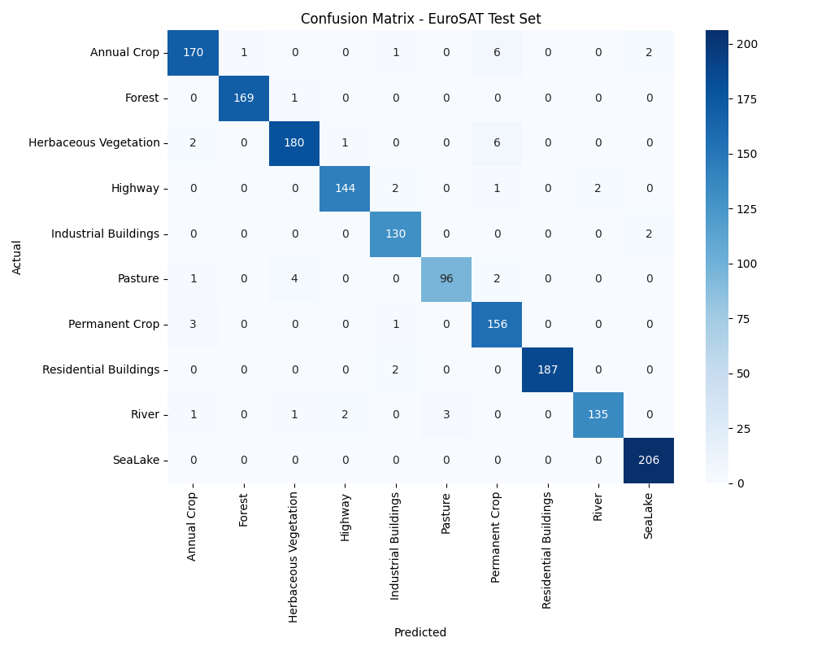
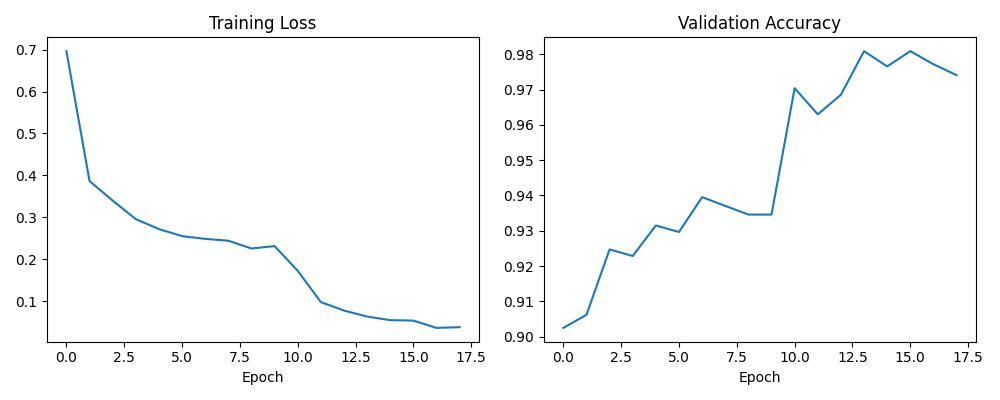
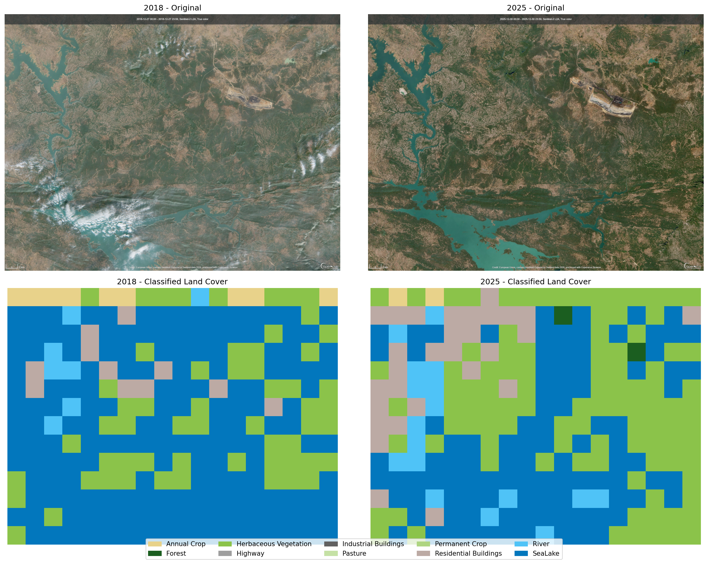
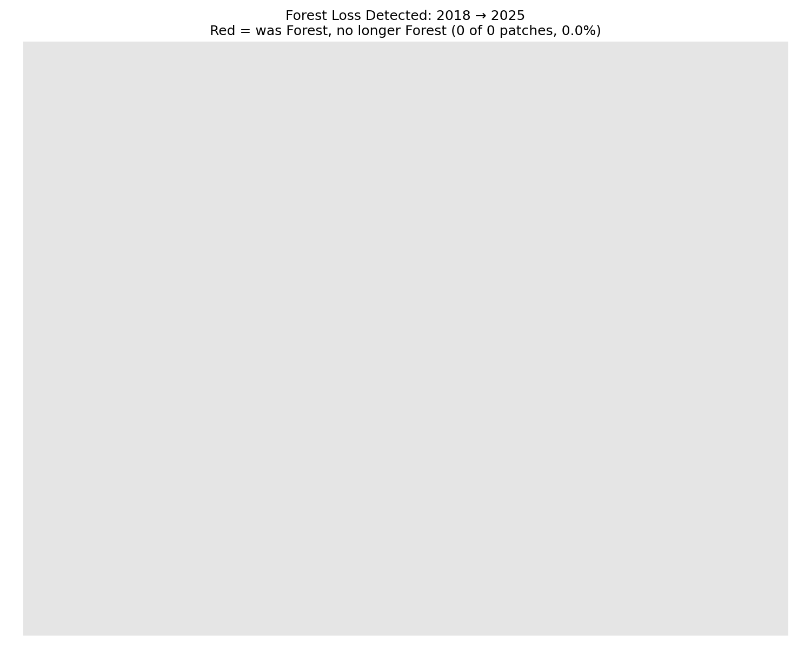

# Transfer Learning for Satellite Land Cover Classification: A Domain-Shift Case Study in Indian Forest Monitoring

**Author:** Harin 
**Date:** June 2026

## Overview

This project trains a convolutional neural network (ResNet50, via transfer learning) to classify satellite land cover into 10 categories using the EuroSAT dataset, then tests whether that European-trained model generalizes to a real-world Indian deforestation case: the Parsa East & Kente Basan (PEKB) coal mine in Hasdeo Arand forest, Chhattisgarh.

The central finding is a **negative result with positive scientific value**: the model, trained exclusively on European Sentinel-2 imagery, fails to meaningfully recognize Indian tropical/dry-deciduous forest as "Forest" at all — instead systematically misclassifying shadowed, hilly forest terrain as "Sea/Lake." This demonstrates a concrete limit of transfer learning across ecological and geographic domains, and is the project's primary contribution.

## Motivation

Global deforestation monitoring increasingly relies on machine learning applied to satellite imagery. Most publicly available labeled datasets (including EuroSAT) are sourced from specific regions — often Europe — raising the question of how well models trained on them generalize elsewhere. This project investigates that question directly using a real, ongoing deforestation case in my home country, India: the PEKB coal mine's expansion through Hasdeo Arand forest, an actively contested site that grew from 218 to 1,389 hectares between 2013 and mid-2025 according to independent satellite analysis (cite: published 2025/2026 study — see References).

## Part 1: Classifier Training (EuroSAT)

### Method
- **Dataset:** EuroSAT RGB, 16,200 labeled 64×64 Sentinel-2 image patches across 10 land cover classes (Annual Crop, Forest, Herbaceous Vegetation, Highway, Industrial Buildings, Pasture, Permanent Crop, Residential Buildings, River, Sea/Lake)
- **Model:** ResNet50 pretrained on ImageNet, transfer learning approach:
  1. Frozen backbone, train replacement final layer only (10 epochs)
  2. Unfreeze full network, fine-tune at lower learning rate (8 epochs)
- **Training details:** Adam optimizer, mixed-precision training, batch size 16, 80/10/10 train/val/test split
- **Hardware:** trained locally on an NVIDIA RTX 3050 (6GB laptop GPU)

### Results

**Overall test accuracy: 97%** (1,620 held-out test images)

| Class | Precision | Recall | F1-score |
|---|---|---|---|
| Annual Crop | 0.96 | 0.94 | 0.95 |
| Forest | 0.99 | 0.99 | 0.99 |
| Herbaceous Vegetation | 0.97 | 0.95 | 0.96 |
| Highway | 0.98 | 0.97 | 0.97 |
| Industrial Buildings | 0.96 | 0.98 | 0.97 |
| Pasture | 0.97 | 0.93 | 0.95 |
| Permanent Crop | 0.91 | 0.97 | 0.94 |
| Residential Buildings | 1.00 | 0.99 | 0.99 |
| River | 0.99 | 0.95 | 0.97 |
| Sea/Lake | 0.98 | 1.00 | 0.99 |

### Analysis
The confusion matrix shows errors clustering among visually/spectrally similar classes: Permanent Crop and Annual Crop are confused in both directions (6 + 3 misclassifications), Pasture and Herbaceous Vegetation overlap (4 misclassifications), and River is occasionally confused with Pasture (3 misclassifications). These patterns are consistent with known limitations of RGB-only (no near-infrared) classification of vegetation types that differ mainly in crop cycle or land management rather than visual texture.

## Part 2: Applying the Model to a Real Indian Deforestation Case

### Method
- **Study area:** Hasdeo Arand forest, Surguja district, Chhattisgarh, India — site of the PEKB coal mine, centered near the village of Ghatbarra (~22.7-22.9°N, 82.75-82.86°E)
- **Imagery source:** Sentinel-2 L2A true-color visual exports from the Copernicus Data Space Browser, two dates 7 years apart: 2018-12-27 and 2025-12-30
- **Method:** Both images were divided into a grid of 130×130 pixel patches, each independently classified by the EuroSAT-trained model, and the two classification grids compared cell-by-cell to detect land cover transitions, particularly Forest → non-Forest.

### Results
Across a 14×18 grid (252 patches) covering the study area:
- **Patches classified as "Forest" in 2018: 0**
- **Patches classified as "Forest" in 2025: 2**
- The overwhelming majority of patches in both years — including visually obvious forested hillside in the original imagery — were classified as **"Sea/Lake."**

This result cannot be interpreted as a meaningful deforestation measurement, because the model essentially never recognized forest as forest in either year. The intended change-detection analysis is therefore invalid as designed — but the failure itself is the project's key finding.

### Why the model failed: domain shift

Two likely, non-exclusive causes:

1. **Ecological domain shift.** EuroSAT's "Forest" examples are temperate European forest under European illumination and seasonal conditions. Hasdeo Arand is dry-deciduous tropical forest, photographed during the Indian dry season, in mountainous terrain with strong cast shadows. The model appears to have learned "dark + textured" as evidence for water rather than forest, a spurious correlation that held within EuroSAT's source distribution but breaks down elsewhere.

2. **Image preprocessing mismatch.** The Sentinel-2 imagery used for this test was exported as a browser-rendered visual JPG screenshot, which applies its own contrast/brightness curve, rather than raw calibrated reflectance values matching EuroSAT's processing pipeline. This is a methodological limitation of this study (see Limitations) and may have compounded the domain-shift effect, though the severity of the failure (0% forest recognition) suggests ecological domain shift is the dominant cause.

## Limitations

- The Indian test imagery was exported as a visually-rendered JPG rather than raw calibrated Sentinel-2 reflectance bands, introducing a possible preprocessing mismatch with the model's training data (see above).
- Patch grid alignment between the 2018 and 2025 images relied on matching browser zoom/export settings rather than precise georeferenced cropping, so patch-to-patch correspondence between years is approximate.
- EuroSAT contains no Indian, tropical, or dry-deciduous forest examples; this study used it "as-is" with no fine-tuning on any Indian data, by design — the point was to test out-of-the-box transfer, not optimize for this domain.
- A 130×130 pixel patch grid is an approximation of EuroSAT's native 64×64 px (640m) patch scale and was not adjusted for differing image resolution between exports.

## Conclusion

A ResNet50 model fine-tuned on EuroSAT achieves strong (97%) accuracy on European satellite imagery but fails almost completely when applied directly to Indian forest terrain, systematically confusing shadowed forested hillsides with water bodies. This result is a concrete demonstration that transfer learning's benefits do not automatically extend across ecological and geographic domains, and underscores the importance of region-specific training data for real-world deforestation monitoring systems — a caution directly relevant to any organization (including this project's intended next step) considering applying European or North American-trained land-cover models to South/Southeast Asian or other ecologically distinct regions.

## Future Work
- Re-run this analysis using raw, radiometrically calibrated Sentinel-2 reflectance bands (rather than rendered JPG exports) to isolate ecological domain shift from preprocessing mismatch
- Fine-tune the model on a small set of labeled Indian Sentinel-2 patches and measure improvement
- Incorporate near-infrared bands (NDVI) to better separate vegetation classes
- Compare detected change against the published PEKB mine expansion figures (218 ha in 2013 → 1,389 ha by mid-2025) as an external validation benchmark once the classifier is reliable on Indian terrain

## References
- Helber, P., et al. (2019). EuroSAT: A Novel Dataset and Deep Learning Benchmark for Land Use and Land Cover Classification. *IEEE Journal of Selected Topics in Applied Earth Observations and Remote Sensing.*
- [PEKB mine expansion study — add full citation once confirmed]
- Global Forest Watch (globalforestwatch.org) — forest change reference data
- Copernicus Data Space Ecosystem (dataspace.copernicus.eu) — Sentinel-2 imagery source

## Reproducing this project
1. `train_local.py` — trains the EuroSAT classifier (requires PyTorch + CUDA GPU recommended)
2. `detect_deforestation.py` — applies the trained model to before/after satellite image pairs
3. See code comments for required file naming and dependencies (`datasets`, `torch`, `torchvision`, `scikit-learn`, `matplotlib`, `seaborn`)
